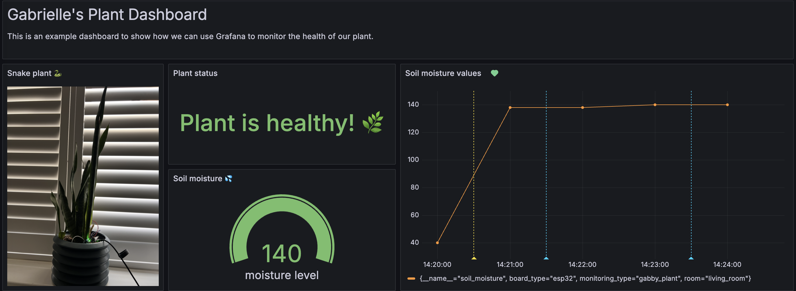

# Basic Plant Monitoring with Arduino and Grafana

A basic plant monitoring project to help my daughter understand how [Arduino](https://www.arduino.cc/), [Prometheus](https://prometheus.io/), and [Grafana](https://grafana.com/) work. This project monitors the soil moisture of your plant and sends the sensor values to Prometheus, which is then visualized to a Grafana dashboard.

This project follows the steps listed in [IoT with Arduino and Grafana](https://github.com/grafana/diy-iot).

## Arduino (How it works)

1. The soil moisture sensor has two metal parts (like two little forks). 
1. When the soil is wet, water helps electricity flow easily between them and when the soil is dry, electricity can’t flow well. 
1. The soil moisture sensor tells the development board how much water is in the soil.
1. Arduino reads the sensor values and gives you a number:
  1. When it's a big number, the soil is dry (needs water 🌵)
  1. When it's a small number, the soil is wet (good for plants! 🌱)

## Prometheus and Grafana (How it works)

1. The sensor values from Arduino are sent and stored to Prometheus.
1. The values are visualized to Grafana, making them easy to understand (and it looks nicer!)

## What you'll need

- [Soil moisture sensor](https://www.amazon.co.uk/AZDelivery-Moisture-Hygrometer-Arduino-including/dp/B07V4KXZ35/ref=sr_1_5?crid=1NOGJ9PHG5Q39&dib=eyJ2IjoiMSJ9.VEKloFU6urkv5BXmo9Spi2kdq71GnTp1LQuROyWwM0B4zVIQxpY1UUHWF5APqybu7tYaQMoBN3Sj2hogf-Brp7P-VPn-31rAXMpumAIon5EUkBIVBzw4FrbY5KMrd22qZk04_eC6SH7XD1dCxQcPfd1cYhBQeEfkiJcWYI3kBMc7-uyWRxCwfoZE_A83jWupv5-LZULjD6kGVeTlRZSZZXPFfCSTNS8cpT-Ik0_jc_iDqlQLMtsXOyUw1xFFUdhR-6sb9JxJ-Dqdcy74Q2dwE3ca9gFv9UdXaVGik74E6YjYIJ7a9Yt3D8OY0mEVn4BJKv7L2eOz-Gjvas-W9x4qjuxicxYulTiZNdhqdGFF8emEjZdWwpquBU0sR4GKCIh3TbYQqz0qBQsS_QDSe26cvpoai6HdJG13fpCG4TmoGh4XU-pyIvLAmkqsWHbY45DN.4WGIEgR3MccWm23imIdCA-1yBHgR6JryFADbRQmSFoQ&dib_tag=se&keywords=soil%2Bmoisture%2Bsensor%2Barduino&qid=1742388917&sprefix=soil%2Bmois%2Caps%2C83&sr=8-5&th=1)
- [ESP32 Development board](https://www.amazon.co.uk/ESP32-DevKitC-WROOM1-Development-Bluetooth/dp/B0CLD4QKT1/ref=sr_1_3?crid=WCB39PXEDR8S&dib=eyJ2IjoiMSJ9.9qzApprBe2BKFYZJ32VwzR7ssnWUufq5f8oHVupe1DA3kuT30fJ2FzrLXmWM2eojCGN3cTwqz7MzzoGkq1NKRZwLc9qJFrfbsLXTlf874qRWXfiG--s_945fXdfdgkzvpRcpRGtr6hqjMZ9z9h8wKyt_9Ct4SWeEeeF3gCo2Y-dLZy4TB3BCZYN1SyME5XPXnyZnxGGkhmrLOlnTNuKso2RToDU9xrQd1acLlW9JeKU.Z19BI5Jjz-rwRnz-Vwhvp703DqG8dSF51iPxPz9L4Xo&dib_tag=se&keywords=esp32+s3&qid=1742388963&sprefix=esp32+s3%2Caps%2C84&sr=8-3)
- [Wiring cables](https://www.amazon.co.uk/Elegoo-120pcs-Multicolored-Breadboard-arduino-colorful/dp/B01EV70C78/ref=sr_1_5?crid=C3NSXKUSEA9O&dib=eyJ2IjoiMSJ9.nVag69geZdTr8O6ihOeW9kRJoRtwhk2BRB1IamOFqniAzR9Swbpr-nhtnaWjO8fq6fldInD18D2vc6p5CTif0mRlwz2V--9qmah89lTwJzKcGtu_0kRKtf300g2zo7vxZbv0_nqiI5qIruoEAQLFkde891tOXI7vPmBdRhzI9P3bX7u4OU2X4pAow0dOHAMXMXwWirY6GGZYP6_MpdBCyQcRG87SlWusNruYbFT4tDVy9rNE1gGlRPWyH5s4fql3Dq8ctxO0dk26hY3yUdoOTprO2xD-V43zl4QzBRREHXl_Pd5mjDy9xGjB_CkBmg0ryNIaXDKtXdzVuGcs4kmxHfwUxpjysmdQfrr5ZYHmI8JCErnp0aFugNwX7H-5UX_7Q4eMblHWcTJbqe-XkhL2FN1o5P6iblJiWjeVpXBYUa_e2OEYPEgOGZSpQtVEFg3c.7oK9ZxfNVrA2b8rr_jMB8UevXhRJoc34VrZM_y-pknM&dib_tag=se&keywords=jumper+cables+arduino&qid=1742389010&sprefix=jumper+cables+%2Caps%2C94&sr=8-5)
- Prometheus (We used the Prometheus instance that comes with the Grafana Cloud account)
- Grafana account

## Resources

- [IoT with Arduino and Grafana](https://github.com/grafana/diy-iot)
- [Easy DIY IoT Projects with Grafana](https://grafana.com/events/grafanacon/2021/diy-iot/)
- [Avocado monitoring with Arduino and Grafana](https://github.com/ivanahuckova/avocado_monitoring_grafana)
